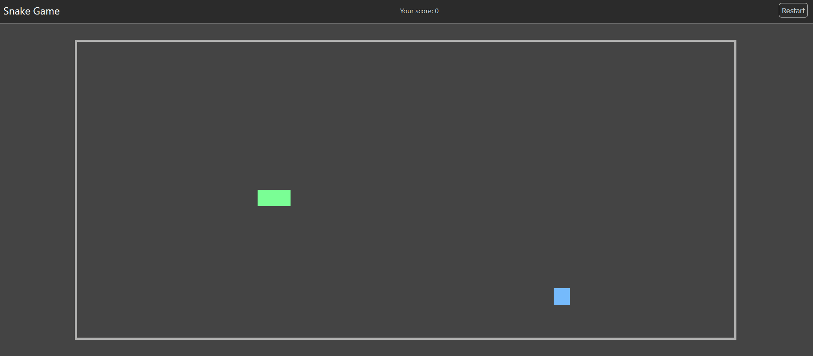

# Snake Game

This is a simple snake game made using React.




I've made this app to learn about the React library, and in particular how to use React's hooks

## How to play

Use the arrow keys on your keyboard to move the snake on the gameboard towards the blue food. Each time the snake eats the food, he increases in size and the score increases on the navigation bar.

The game ends once the snake eats itself. You can press the restart button on the navigation bar to start a new game.

## Usage

With Node.js and npm installed, simply build the app with

```npm install```

and then run the app with

```npm run start```

## Libraries used

The only library used in this app is [styled component](https://styled-components.com/) to add CSS styles certain elements such as the grid cases and restart button.